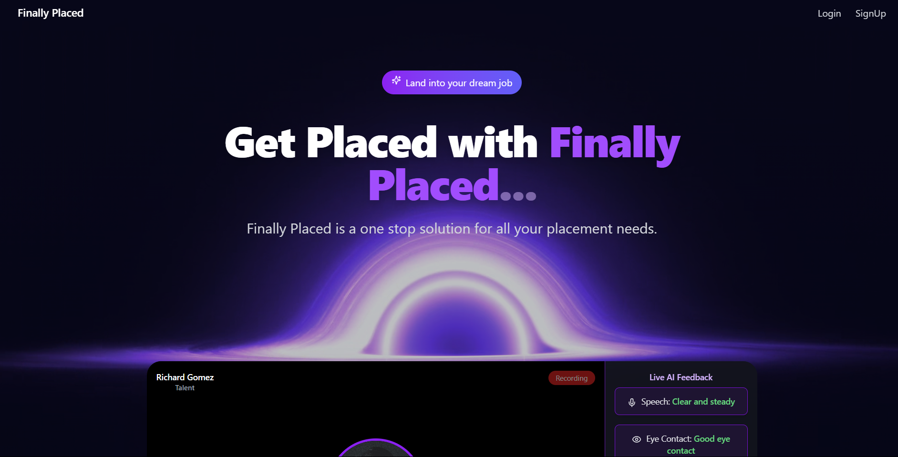
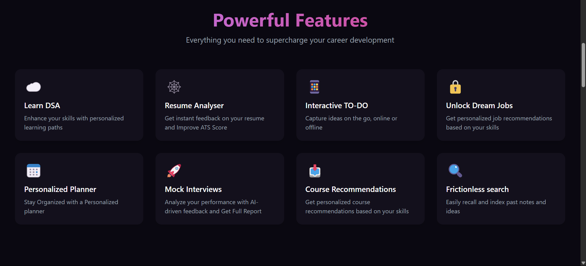
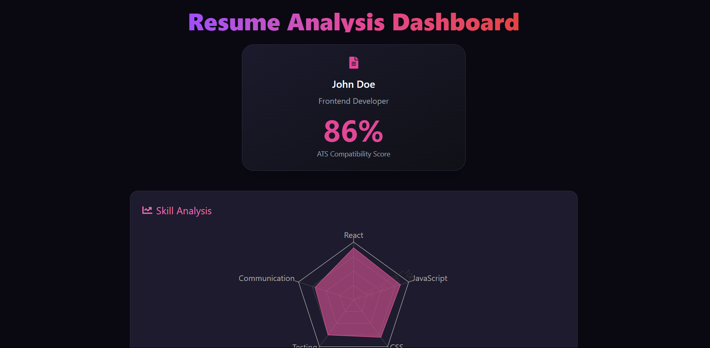
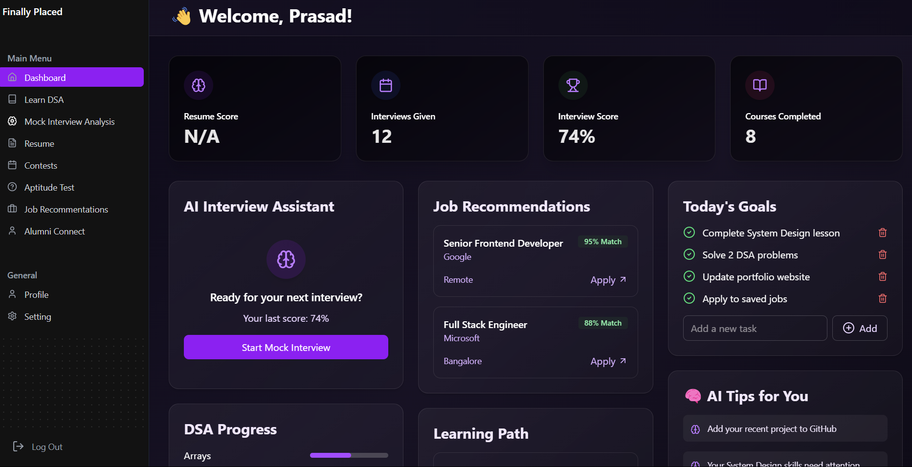
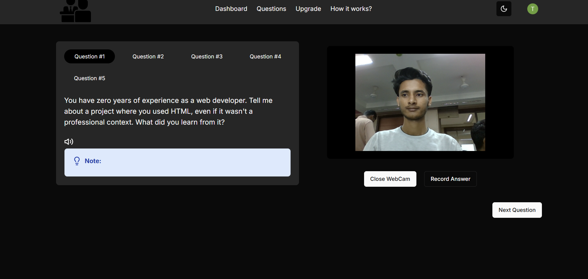
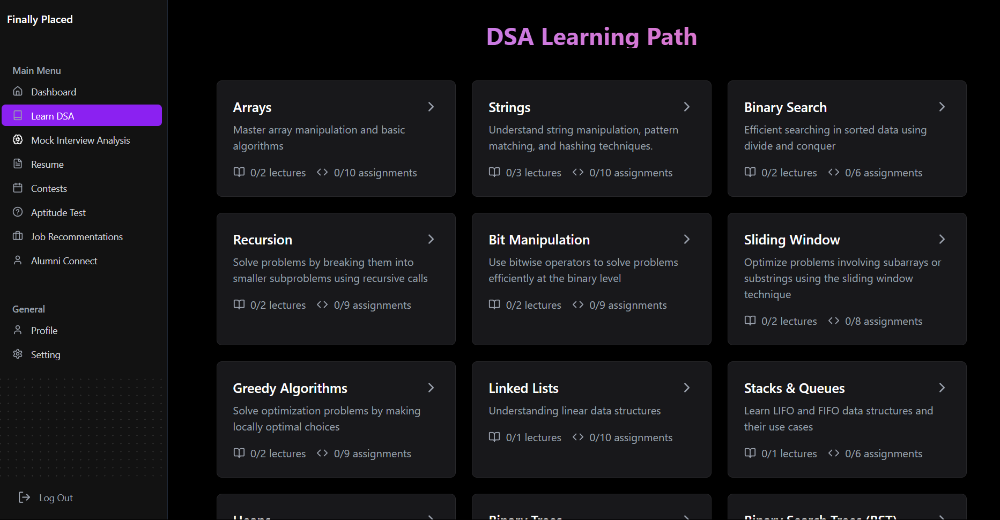
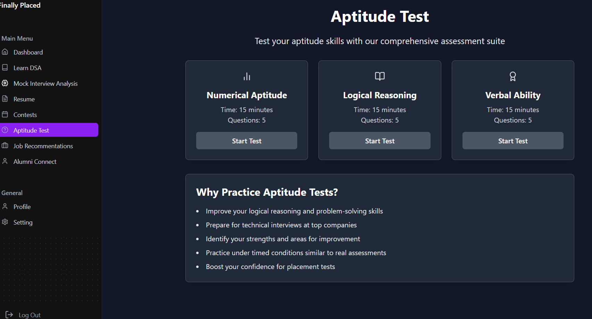
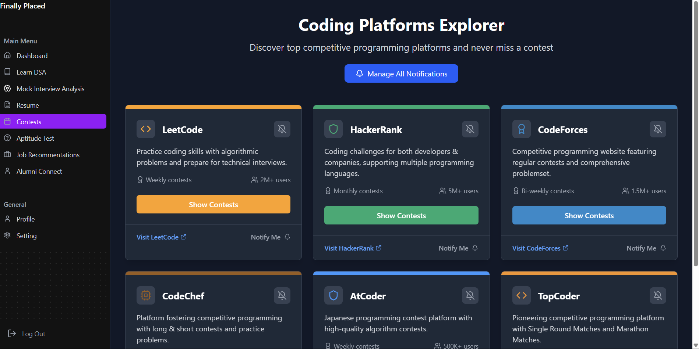

# 💼 Finally Placed - AI Powered Placement Assistant

 *Replace with actual banner image*

A sleek and personalized career development dashboard built with *React*. Designed to supercharge your job preparation journey, this platform offers a unified interface to manage your resume, track DSA progress, access curated learning resources, and get AI-powered interview feedback.

## ✨ Key Features

### 📊 Dashboard
- Personalized progress tracking
- Daily goals and achievement metrics
- Quick access to all platform features

### 📄 Resume Analyzer
- Instant ATS compatibility scoring
- Skill gap analysis
- AI-powered improvement suggestions

### 🤖 AI Interview Assistant
- Real-time speech analysis (pace, clarity)
- Eye contact and posture tracking
- Detailed performance reports
- Personalized improvement tips

### 🧠 Learning Hub
- Structured DSA learning paths
- Progress tracking (lectures/assignments)
- Personalized course recommendations

### 💼 Career Tools
- Smart job matching algorithm
- Application tracking
- Company-specific preparation resources

### 🧪 Aptitude Training
- Numerical reasoning tests
- Logical reasoning exercises
- Verbal ability assessments

## 🖥️ Screenshots
| Home | Features | Resume Page |
|-----------|-----------------|----------------|
|  |  |  |
| Dashboard | Resume Analysis | Mock Interview |
|-----------|-----------------|----------------|
|  |  |  |

| Learning Path | Aptitude Test | Contests |
|---------------|---------------------|---------------|
|  |  |  |

## 🛠️ Tech Stack

### Frontend
- **React** - Core framework
- **Tailwind CSS** - Styling and UI components
- **React Hooks** - State management
- **Chart.js** - Data visualization

### Backend
- **Node.js** - Server environment
- **Express** - API framework
- **MongoDB** - Database

### AI/ML Components
- **OpenAI API** - Response analysis
- **TensorFlow** - Voice and sentiment analysis
- **OpenCV** - Facial expression tracking
- **MediaPipe** - Gesture detection

### APIs
- **RapidAPI** - Job search integration
- **Gemini API** - Resume analysis

## 🚀 Getting Started

### Prerequisites
- Node.js (v16+)
- npm (v8+)
- MongoDB Atlas account

### Installation
1. Clone the repository:
   ```bash
   git clone https://github.com/Tejas-Santosh-Nalawade/Dev-Clash.git
   cd Dev-Clash
   npm install
   npm run dev
